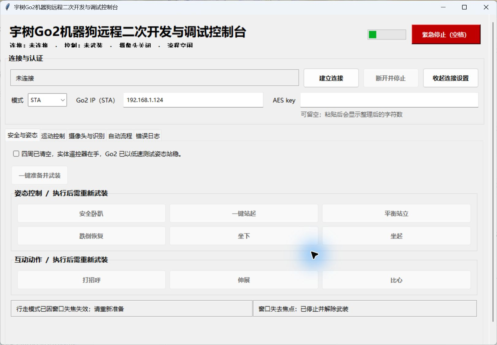

# 宇树 Go2 Pro Windows 控制台

面向 Windows 的 Go2 Pro 远程二次开发与调试工具。项目使用 Python、Tkinter 和社区库 `unitree_webrtc_connect`，提供安全运动控制、姿态动作、摄像头预览、人员识别、自动流程和错误日志。



> [!WARNING]
> 这是会驱动实体机器人的实验性软件。首次测试必须清空四周、保持低速，并由旁人手持实体遥控器负责急停。不要在人员、宠物、楼梯、玻璃、车辆或贵重物品附近运行。

## 主要功能

- STA / AP 两种 WebRTC 连接方式；AES key 只在当前进程中使用，不保存。
- 前后、横移和转向控制，支持按钮锁存与键盘按住控制。
- 安全卧趴、站起、平衡站立、跌倒恢复、坐下、坐起、打招呼、伸展和比心。
- Go2 前置摄像头只读预览，不录像、不保存。
- CPU 版 YOLOX-Tiny 人员识别；识别结果不会自动触发运动。
- 可编辑、保存和读取按时间执行的自动流程。
- 状态联锁、失焦停止、看门狗、空格急停和界面错误日志。
- Windows 原生浅色、自适应单工作区界面。

## 快速开始

环境要求：Windows 10/11、64 位 Python 3.10–3.14。

按顺序运行：

```text
01_安装环境_双击.bat
03_运行离线测试_双击.bat
02_启动安全控制器_双击.bat
```

也可以在 PowerShell 中启动：

```powershell
cd "D:\你的项目路径\Go2 Controller"
.\.venv\Scripts\python.exe -m go2_safe_control
```

## 文档

- [完整使用与安全说明](README_先看我.md)
- [Python 小白系统学习指南](PYTHON_小白系统学习指南.md)
- [界面设计规范](DESIGN_SYSTEM.md)
- [人员识别模型来源与校验](models/README.md)

## 离线验证

```powershell
.\.venv\Scripts\python.exe -m unittest discover -s tests
```

当前测试覆盖输入校验、安全策略、WebRTC 会话封装、动作协议、摄像头帧、人员识别和自动流程。离线测试通过不代表具体 Go2 Pro 固件上的所有高层动作均可用，真机测试仍应从单一动作和最低速度开始。

## 隐私与安全边界

- 项目不保存 Unitree 账号密码、AES key 或 access token。
- `.venv`、IDE 本机配置、日志、证书、密钥和分享压缩包不会提交到 Git。
- 人员识别只在本机处理摄像头帧，不录像、不保存，也不会自动控制机器狗追踪人员。
- 网络中断、电脑断电或进程被强制结束时，软件无法保证停止命令一定送达，因此实体遥控器急停不可省略。

## 第三方项目

- [`unitree_webrtc_connect`](https://github.com/legion1581/unitree_webrtc_connect)
- [`YOLOX`](https://github.com/Megvii-BaseDetection/YOLOX)

本项目不是 Unitree 官方软件。设备固件、服务权限和接口差异可能影响实际功能。
